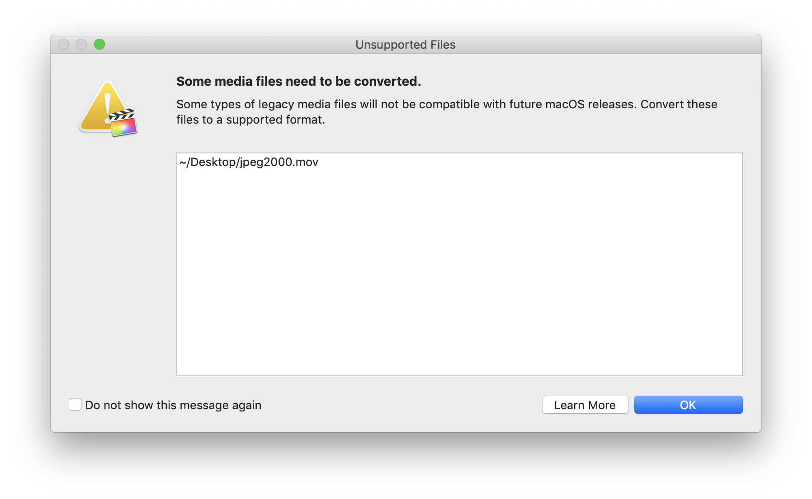

# Legacy Media in Final Cut Pro
---

Starting in [Final Cut Pro 10.4.4](https://support.apple.com/en-au/HT201237), Apple started displaying this dialog box when you import "legacy" media:

When you click **Learn More** you're taken to [this page](https://support.apple.com/en-au/HT209000), which says:

> To prepare for future macOS releases, complete Final Cut Pro projects that contain legacy media.
>
> In Final Cut Pro, you might see an alert that legacy media files won't be compatible with future macOS releases.
> Legacy media files are compatible with macOS Mojave, but they won't be with future macOS releases. Legacy media can include footage recorded with cameras like Sony HDCAM-SR cameras, footage from GoPro cameras recorded in the CineForm format, video files in the Avid DNxHD/DNxHR format created with software, footage shot with many other older cameras, or files modified with older software.
> While your Mac is running macOS High Sierra or macOS Mojave, follow the steps in this article to back up your Final Cut Pro libraries, and complete and update projects that contain legacy media.
> To make sure media you create now will be compatible with future macOS releases, use [cameras](https://support.apple.com/kb/HT204203) and [media formats](https://support.apple.com/kb/PH12754) supported by Final Cut Pro.

This caused a bit of confusion and fear amongst the post production community, especially in Final Cut Pro land.

Jon Chappell at Digital Rebellion did an awesome blog post with his [Thoughts on 32-bit codecs being phased out in macOS](https://www.digitalrebellion.com/blog/posts/thoughts_on_32_bit_codecs_being_phased_out_in_macos).

There's also been lots of discussion on [Reddit](https://old.reddit.com/r/editors/comments/9yl2p7/civil_discussion_ramifications_of_legacy_codecs/), Twitter and Facebook.

Avid has posted their response [here](http://avid.force.com/pkb/articles/en_US/Compatibility/The-future-of-Avid-DNx-on-the-Apple-platform?fbclid=IwAR2AKHZW7kXDrRwQiJiO-pESeRjAY7EA78JG1EeE-CaY8nm3j7jo75JsbHE), specifically:

> Apple has released an article related to the future of codec support with Apple FCP X and identified that DNxHD and DNxHR will not be supported in future releases of that product. DNxHD and DNxHR within the QuickTime wrapper have been traditionally supported by various products on the MacOS platform  either through native integration by various MacOS based applications, or through the plugin mechanism that the QuickTime 7 ™ libraries provided.
>
> With the deprecation of the QuickTime 7 libraries, support for these formats is now based on the each media application supporting these codecs natively using 64 bit compliant and performance-tuned libraries available through Avid, or each application vendors own implementation using the SMPTE VC-3  standards specifications that the DNx family of codecs are based on.
>
> As such, for customers using Apple Computers and MacOS, this announcement does not affect Pro Tools and Media Composer, any other products that have chosen to implement DNxHD and DNxHR natively in the aforementioned manner, or, DNxHD/HR supported through MXF wrappers.  DNxHD, DNxHR, Pro Tools and Media Composer will continue to be supported and will be compatible with the current and future release of Mac OS. We will continue to improve or introduce new features for DNxHD and DNxHR, proven by recent release of DNxUncompressed option, and will support these new features on various operating systems, including MacOS.

However, I still feel like there's some confusion and misinformation, so I thought I'd offer my thoughts as well...

As of Mojave the [QTKit Framework](https://developer.apple.com/documentation/qtkit) still exists and ships with macOS. It's officially depreciated - but MANY apps still use it, including QuickTime Player X and Final Cut Pro X.

In Apple's developer documentation it says:

> Clients of QTMovieModernizer should import QTMovieModernizer.h instead; **QTKit.h will be removed in a future release.**

In a future version of macOS QTKit will no longer be bundled. The only way for macOS to access `.mov` files will be via the AVFoundation Framework, introduced in OS X 10.7. Apple has been moving away from QTKit towards AVFoundation for years - basically ever since they added AVFoundation to the iOS platform.

Because Apple realised that QuickTime on Windows had so many security holes, they ended up [scrapping QuickTime on Windows](https://www.macrumors.com/2016/04/14/apple-ending-quicktime-windows-support/) very suddenly and dramatically, which caused quite a stir in the Adobe world a while back. As of Premiere 12.0, Adobe dropped support for all of the QTKit-based codecs, and built their own licensed 64-bit implementation of ProRes decoding on Windows, as well as for other codecs, such as the Animation Codec, CineForm and DNxHD/HR. So Premiere users have been through this change already.

Resolve also has their own 64-bit implementations of ProRes, the Animation Codec, CineForm, DNxHD/HR, etc. - they needed to, because they want a solution that works across Mac, Windows & Linux.

Avid has their own 64-bit implementation of DNxHD/HR, but currently still rely on QTKit on Mac for some older Mac codecs (i.e. you can still import a `.mov` wrapper with a Sorenson Video encoded video within).

So... what happens when macOS 10.15 or 10.16 ships which finally drops QTKit all together? Basically, the QuickTime `.mov` wrapper isn't going anywhere - this will continue to be a container for ProRes, H264, HEVC, etc. What will be going away is any older codecs within a QuickTime `.mov` wrapper that use a legacy QTKit Codec.

All the people saying "MPEG Streamclip will save the day" are mistaken - the "Export to QuickTime" option in MPEG Streamclip uses QTKit - in fact, the codecs listed in the QuickTime export options of MPEG Streamclip is basically a good list of what's disappearing. For MPEG Streamclip to support older QTKit-based codecs, the developers would need to do some serious reverse engineering and re-writing, which I doubt they'll do.

Specially these codecs that up-until-now ship with macOS will no longer work natively on macOS with a `.mov` container when Apple scrap QTKit all together:

- Apple BMP
- Apple Cinepak
- Apple Component Video - YUV422
- Apple Graphics
- Apple H.261
- Apple Motion JPEG A
- Apple Motion JPEG B
- Apple None
- Apple Pixlet Video
- Apple Planar RGB
- Apple PNG
- Apple TGA
- Apple TIFF
- Apple Video
- H.263
- JPEG 2000 Encoder
- Sorenson Video 3 Compressor
- Sorenson Video Compressor

It's important to note that these are VIDEO codecs WITHIN a QuickTime wrapper. Obviously `.tiff` still images will still be able to be imported into Final Cut Pro.

Other QTKit codecs, installed by third parties, such as:

- AVID 1:1x
- AVID Meridien Compressed Codec
- AVID Meridien Uncompressed Codec
- AVID DV100 Codec
- AVID DNxHR Codec
- AVID DNxHD Codec
- AVID DV Codec
- AVID JPEG 2000 Codec
- AVID MPEG2 50mbit Codec
- AVID RGBPacked Codec
- AVID Packed Codec
- RED Digital Cinema REDCODE

...will also fail to work WITHIN a QuickTime Wrapper. Obviously a `.r3d` file will still be able to be imported into Final Cut Pro.

Also, on a recent [Final Cut Pro Radio podcast](http://fcpradio.com/episode074.html) I heard Bradley Olsen express concerns that JPEG 2000 is on the list. This will have absolutely no impact on DCP creation. Again, DaVinci Resolve has it's own 64-bit implementations of all the codecs its supports, so the fact that you won't be able to open a JPEG 2000 video within a QuickTime `.mov` wrapper will really have no impact on anything, as DCP's require MXF wrapped codecs anyway.

People who are concerned that dropping QTKit will have any impact on MXF files, are also completely misguided. MXF is an industry standard file format for video and audio. Similar to the QuickTime `.mov` wrapper, MXF files contain information about the media contained in the MXF file. MXF support on macOS is handled by the "Pro Video Formats" software update, completely independent from Final Cut Pro, and gives native macOS support for:

- MXF Reader for importing
- AES3 Audio Codec
- MXF Export including AVC-Intra
- Compressor settings for exporting MXF files

However, AFAIK, as of today, Apple doesn't have it's own implementation of the SMPTE VC-3 standard (i.e. DNxHD/HR), so currently when you're importing DNxHD/HR into Final Cut Pro you're actually using Avid's QuickTime codecs (which requires installation of a seperate package - Avid QuickTime Codecs LE), which works on QTKit.

As of today, there's currently no way for third parties to write their own AV Foundation codecs, however, third parties can write their own "codec support" for Final Cut Pro (i.e. REDCODE RAW and Canon Cinema RAW Light require additional software to use these codecs within Final Cut Pro).

In regards to DNxHD/HR, there's basically a few options:

1) Apple writes their own SMPTE VC-3 compliant codec that works either via AVFoundation system-wide, or just solely for ProApps (like the XAVC implementation currently is). I reckon this is a possibility, given that SMPTE VC-3 is an open standard.
2) Avid writes their own set of codecs specifically for Apple's ProApps to access DNxHD/DNxHR. I can't see this happening.
3) Apple allows third party AV Foundation-based codecs, which allows Avid to write a codec that works system-wide, on both Mac & iOS. Apple's had many years to do this though, and they haven't - so I think the chance of them allowing 3rd party AV Foundation-based codecs is pretty slim.

However, it's also important to note the wording of Apple's "About legacy media in Final Cut Pro X" article, specifically:

> video files in the Avid DNxHD/DNxHR format created **with software**

Note the **with software**. Keep in mind, that ARRI cameras can record DNxHD/HR as well as ProRes, so it SOUNDS like Apple might already have a solution up their sleeve.

So the big question is... will dropping QTKit change anything for your average editor? Nope, I doubt it.

There will be a few cases where editors will be using old stock footage, downloaded as a QuickTime using an old legacy codec, but most people convert these files to ProRes anyway, for a smoother editing experience, and if you're using FCPX, I'd suggest just making "optimised media" of any clips that throw up the legacy dialog.

Hopefully someone like Jon Chappell (or maybe we could even do it in CommandPost?) will make a tool to scan a drive for "legacy media", then you could just drag everything into Compressor to convert.