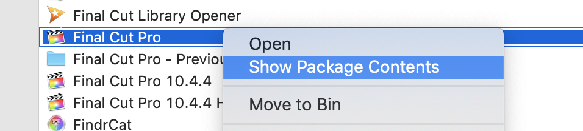
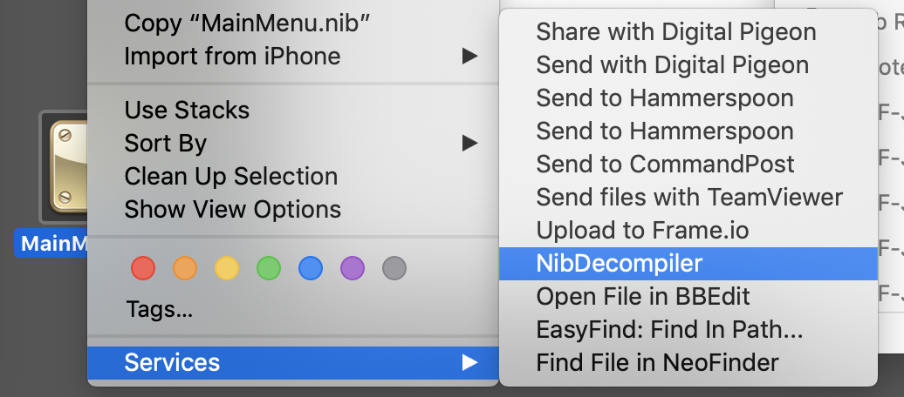
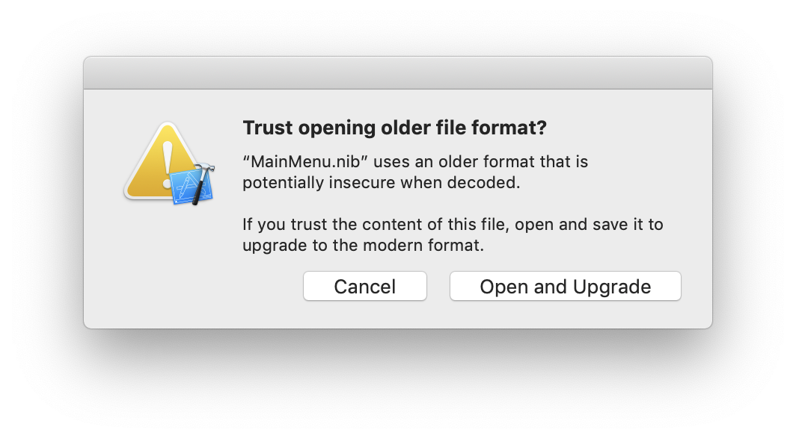
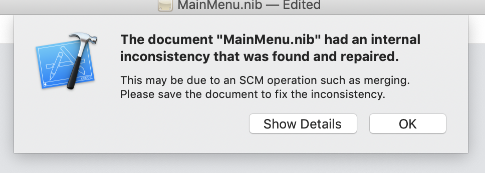
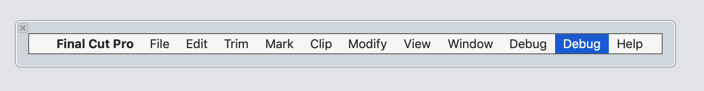
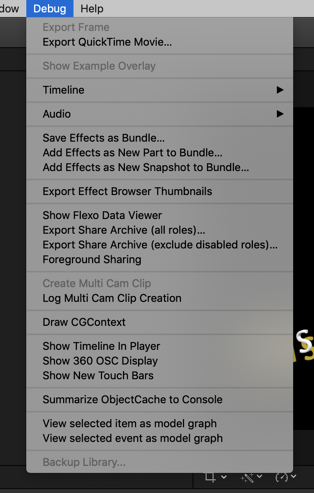

# Final Cut Pro Debug Menu
---

Since Final Cut Pro 10.0.0, there has been a secret debug menu, that's not user accessible.

You can explore the debug menu by following these steps:

* Install [Xcode](https://developer.apple.com/xcode/) if you don't already have it.
* Install [NibDecompiler](https://github.com/akahan/Nib-Decompiler) using the instructions on their GitHub README.
* Make a duplicate of your Final Cut Pro application for safety.
* Right click on the Final Cut Pro application bundle and select "Show Package Contents".

* Navigate to "Contents > Resources > en.lproj" (assuming your system is set to English).
* Copy the `MainMenu.nib` file to your desktop.
* Right click on the `MainMenu.nib` file and select "Services > NibDecompiler".

* Double click on `MainMenu.nib` to open it in Xcode.
* If presented with a "Trust opening older file format?" warning, select "Open and Upgrade".

* If presented with a "The document MainMenu.nib has an internal inconsistency that was found and repaired", select "OK".

* Select the "Debug" menu in the Interface Builder and press **CMD+D** to duplicate it.

* Close Xcode.
* Move the `MainMenu.nib` file from your desktop back into your Final Cut Pro application, replacing the original.
* Now when you open Final Cut Pro, you'll have access to the Debug Menu.

