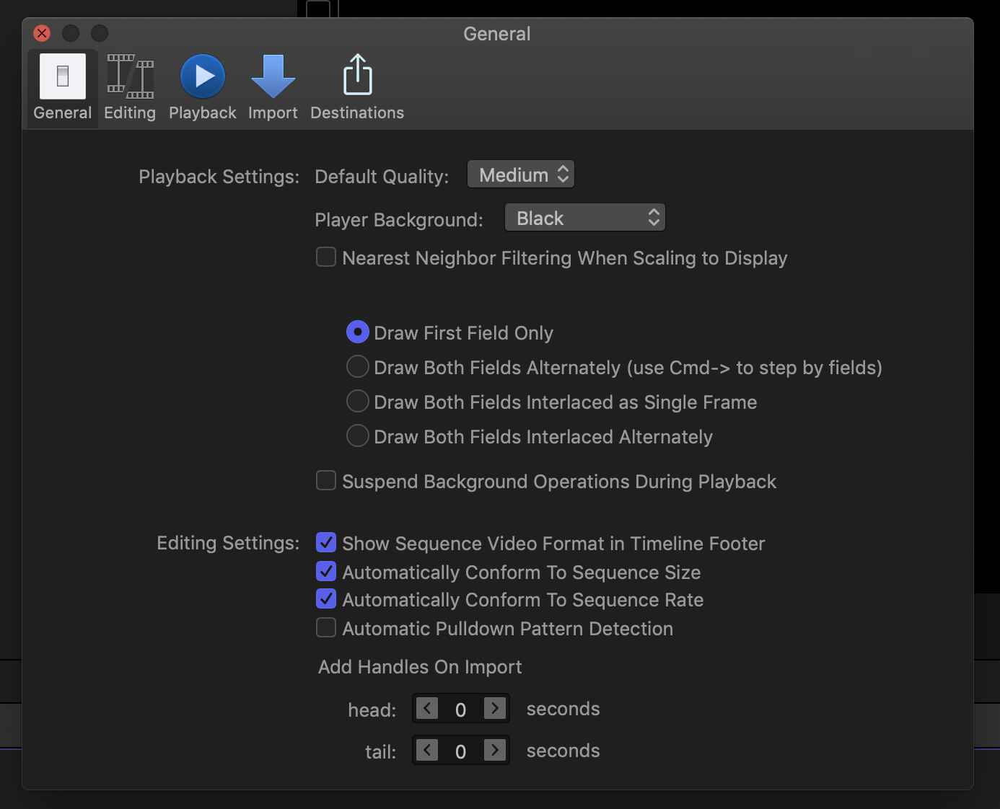

# Final Cut Pro Debug Preferences
---

Since Final Cut Pro 10.0.0, there has been some secret debug preferences, that are not user accessible.

In earlier versions of Final Cut Pro there were a couple of different debug preferences, however as of 10.4.4, there's only one.

You can explore these debug preferences by following these steps:

* Make a duplicate of your Final Cut Pro application for safety.
* Right click on the Final Cut Pro application bundle and select "Show Package Contents".

* Navigate to "Contents > Resources > en.lproj" (assuming your system is set to English).
* Rename `PEAppGeneralPreferencesModule.nib` to `PEAppGeneralPreferencesModule ORIGINAL.nib`.
* Duplicate `PEAppUserPreferencesModule.nib`.
* Rename the duplicate of `PEAppUserPreferencesModule.nib` to `PEAppGeneralPreferencesModule.nib`.
* Now when you start Final Cut Pro, instead of the "General" Preferences, you'll see the hidden "User" Preferences.

