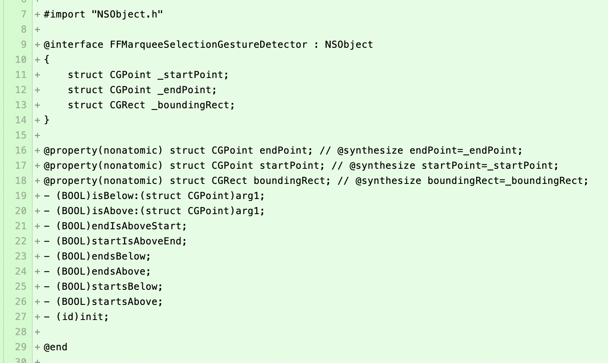
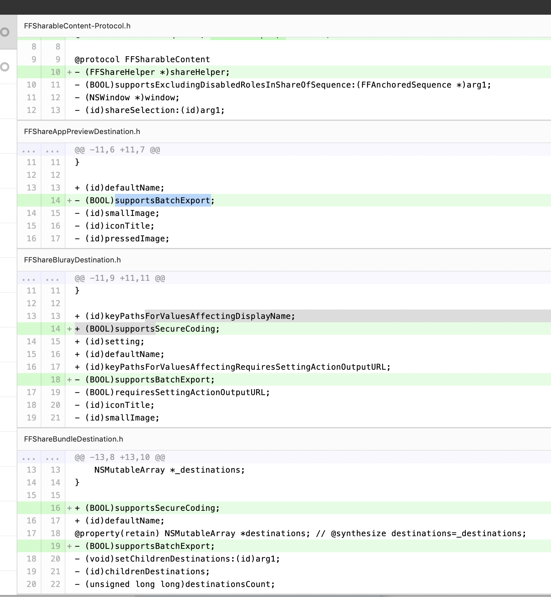
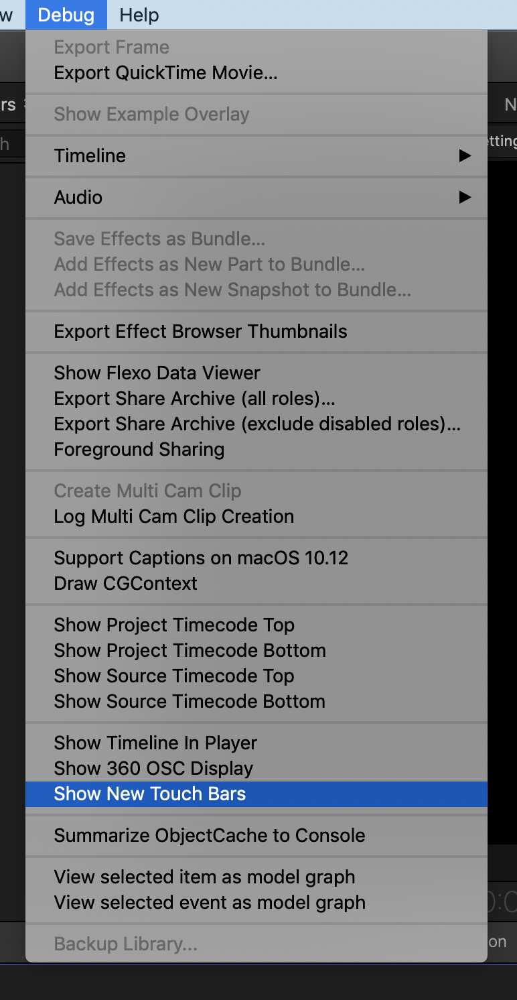
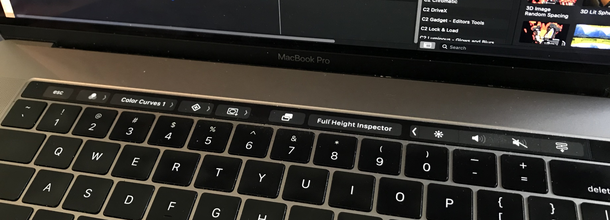
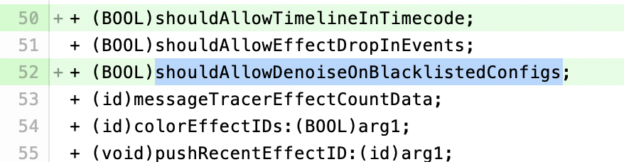
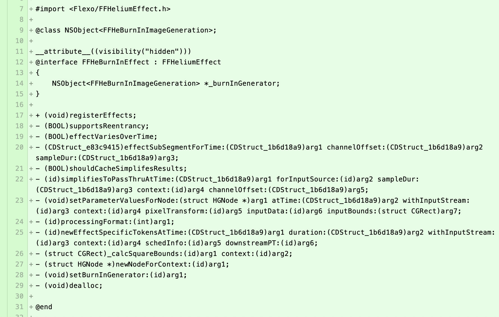
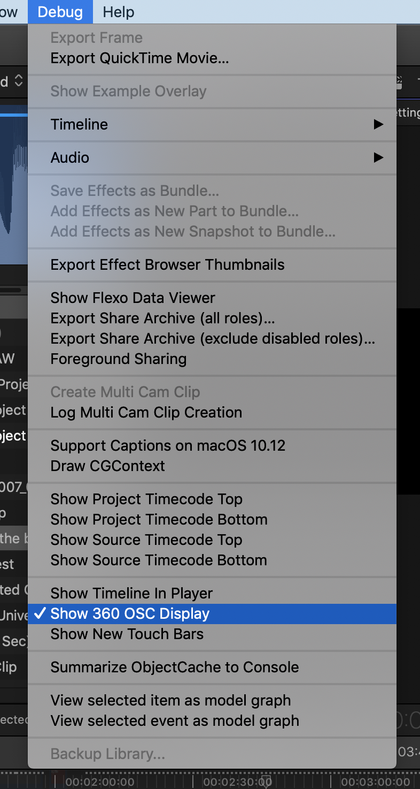

# Final Cut Pro November 2018 Predictions
---

In the lead up to the [2018 Creative Summit](http://www.fcpxcreativesummit.com) I thought it would be fun to put together a list of predictions of what I think we'll see in the next Final Cut Pro release.

I'm slightly conflicted as to whether we'll see 10.4.4 (and possibly a preview of 10.5?), or whether they'll just release 10.5.

Based on some [tweaks](https://github.com/CommandPost/CommandPost/commit/2075c8fca3c96c0aa1041808e9c7836776169b58) we needed to make to CommandPost, I know at least some of the pre-release versions of Final Cut Pro had a 10.4.x version, but that could just mean that internal development was done in the 10.4 branch, and when they release they'll bump it to 10.5.

However, if I had to pick a side, my prediction is that we'll probably see a fairly decent 10.4.4 release later this week (or a minor update, if compared to DaVinci Resolve, where even their point updates are MASSIVE).

If Apple do preview 10.5, I predict the big changes will be in the underlying architecture - I'd imagine the big focus will be on improving rendering speeds, better 3D graphics support, major changes to Apple Motion, and a bunch of new Machine Learning based functionality.

As much as everyone is hoping and dreaming for improved collaboration features - I can't see this happening within Apple's original "10 year plan". I think this will be later down the line, maybe Final Cut Pro 11?

As for what we'll see in this next update, based on some digging around my guess is:

---

## Improved Metal2 Support

There's still LOTS of functions in Final Cut Pro X that rely on OpenCL/OpenGL, so I'd imagine Apple is slowing transitioning as much as they can to the more modern Metal2 Framework.

---

## Improved Gesture Support

Given Apple [just released](https://www.theverge.com/2018/11/14/18093628/apple-macbook-pro-amd-radeon-pro-vega-20-16-gpu-options-buy) an update to the MacBook Pro, it's safe to assume this new beasty (and very expensive) laptop will make an appearance at the Creative Summit, and what better way to show off the new laptop but by throwing in some awesome new gesture support in Final Cut Pro.

Based on some new functions in the latest iMovie Framework headers, we definitely think improved gesture support is on the cards - but whether this is for FCPX on macOS or iMovie on iOS, it's hard to say.

There's no clues to this in the code, but it would be really awesome if you could just "swipe" to open the Inspector, for example, similar to how you can quickly and easily open panels on an Autodesk Flame using a tablet.

Again, there's no clues to this in the code, but given how big the Multi-Touch trackpad is on the new MacBook Pro - it would be REALLY awesome if you could control the colour wheels using the trackpad, similar to how [AudioSwift](https://audioswiftapp.com/lightroom/) works in LightRoom.

---

## Browser Batch Export

One thing that users have been requesting for years now, is batch export support. We solved this with [CommandPost](https://commandpost.io), however it's still not perfect, so a native solution would be very welcome.

Based on some new functions in the latest iMovie Framework headers, we definitely think this is on the cards for the next release.

---

## Improved Touch Bar Support

There's been a "Show New Touch Bars" button in the Final Cut Pro debug menu for a while now, so this has always been on the cards, but I think we might finally see this shipping in the next release.

Here's a sneak peak of what it looks like in it's current form:

---

## Image Noise Reduction

This was something that Apple previously accidentally included in the release notes, but then later pulled, so we know it's coming.

However, based on some new functions in the latest iMovie Framework headers, I think it's safe to say we'll see this finally in the next release.

---

## Better Metadata Generator & Effects

Based on some additions in the iMovie Flexo Framework headers, I think we'll probably see some new generators that allow you to do more complex timecode and metadata text overlays.

At the moment, the "Timecode" effect and generator is pretty darn limited (especially compared to Avid Media Composer), so it would be great if you could actually burn clip names, or notes into an export.

---

## 360 On-screen Display

There's been a "Show 360 OSC Display" item in the Final Cut Pro debug menu for a while now.

My guess, is that we'll see something similar to what Adobe Premiere already has, i.e. the ability to show on-screen controls on your VR headset.

I don't actually own a VR headset, so I haven't actually tried enabling this option with a VR headset connected, so I'm not sure what this would look like.

